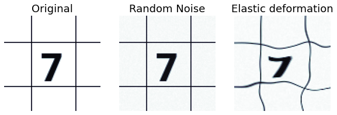
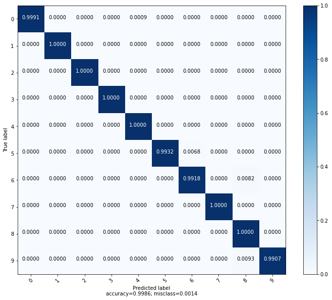
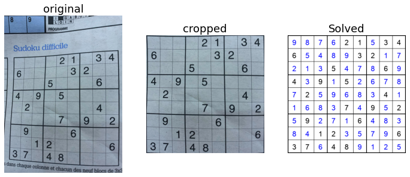

# Solving a sudoku with backtracking and deep learning

## Table of contents:

* Grid Detection
* Data generation
* CNN training
* Solving the grid with backstrapping
* App creation

## Dependencies 

* opencv-Python
* Numpy
* Pillow
* Keras
* Scipy

## Grid detection:

(details and code for this section can be found in [this notebook](grid_detection.ipynb))

First, some preprocessing:

Detect the grid contour and corners using opencv:

Extraction of digit area:

## Data Generation

*(details and code for this section can be found in [this notebook](digit_generation&training.ipynb))

First, generate random digit image with random field around the digit area:

Produce random noise and elastic deformation for model robustness:

Some exemples of Generated images:

## Train the model with Keras (Tensorflow backend):

*(details and code in the notebook: 'digit_generation&training.ipynb')*

Evaluation on validation set composed of "real life" sudoku images:
28 grids, 2268 images (sudoku cells) for a total accuracy of 99.51%.

## Solving the grid with backtracking

see [this notebook](solve_grid.ipynb) for details.

## Putting everything in a desktop app.

For this secton we will use Kivy, an opensource python library for application developpement on multiple OS.$
The code is available in the kivy_app folder.

