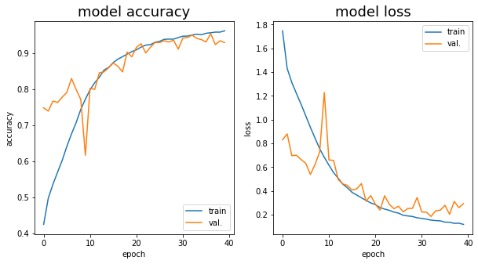

# Solving a sudoku with backstrapping and deep learning

## Table of contents:

* Grid Detection
* Data generation
* CNN training
* Solving the grid with backstrapping

## Dependencies 

* opencv-Python
* Numpy
* Pillow
* Keras
* Scipy

## Grid detection:

*(details and code for this section can be found in the notebook: grid_detection.ipynb)*

First, some preprocessing:

Detect the grid contour and corners using opencv:

Extraction of digit area:

## Data Generation

*(details and code for this section can be found in the notebook: 'digit_generation&training.ipynb')*

First, generate random digit image with random field around the digit area:

Produce random noise and elastic deformation for model robustness:

Some exemples of Generated images:

## Train the model with Keras (Tensorflow backend):

*(details and code in the notebook: 'digit_generation&training.ipynb')*

Evaluation on validation set composed of "real life" sudoku images:
4 grids, 324 images (sudoku cells) for a total acuracy of 1 (100%).

## Solving the grid with backstrapping

see [this noteook](solve_grid.ipynb) for details.
